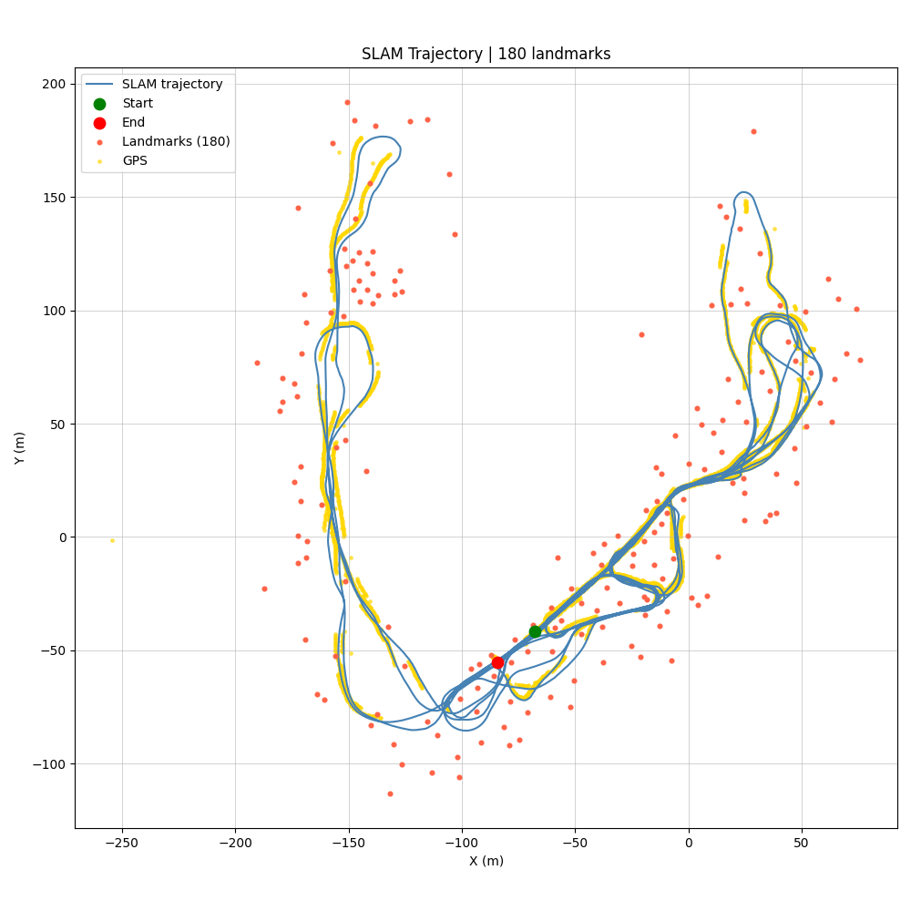

# Master's Thesis

This repository contains the code developed for **TTK4900 – Master’s Thesis in Engineering Cybernetics** at **NTNU**. 

Description: TODO
 
## Setup

TODO

### Requirements
### Install

## Structure of project

TODO

